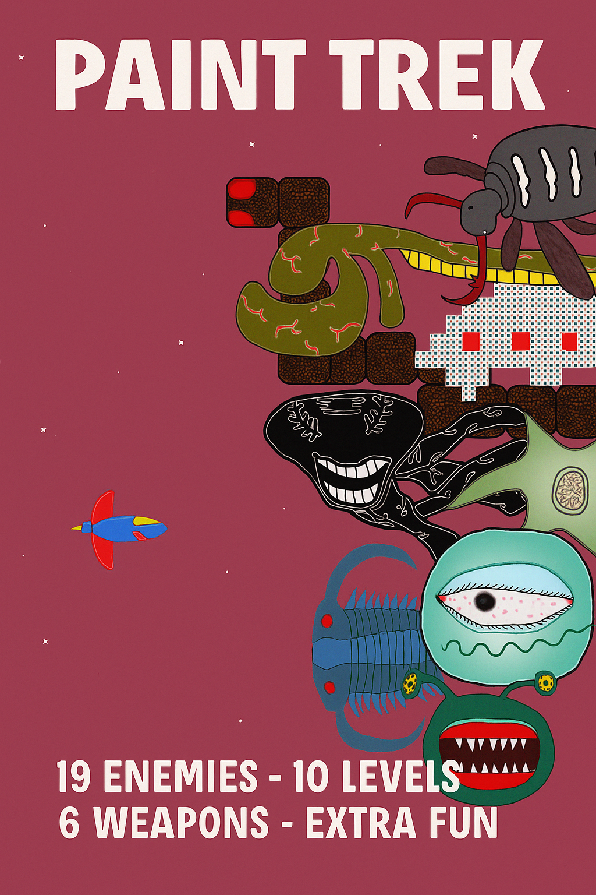
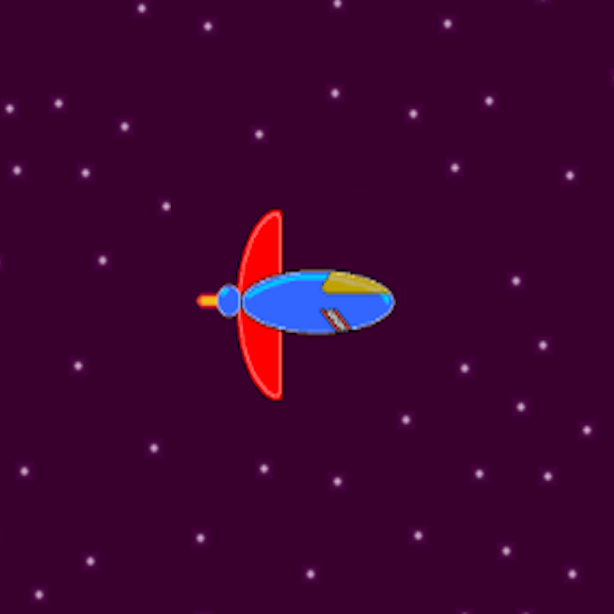
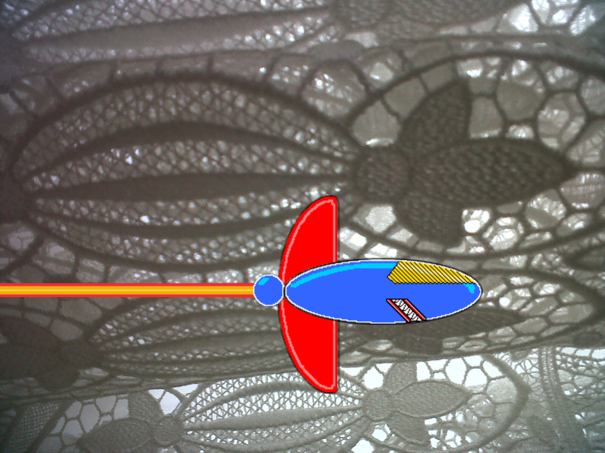

# Paint Trek (2014-2025)

<div align="center">



**Created by Arar Game**

[](https://www.microsoft.com/store)
[](https://www.monogame.net/)
[](https://dotnet.microsoft.com/)
[](https://docs.microsoft.com/en-us/dotnet/csharp/)
[](#license)

*A retro-inspired space shooter that has evolved from XNA Framework to modern MonoGame*

[Download](#download) • [Features](#features) • [Screenshots](#screenshots) • [Technical Details](#technical-details)

</div>

---

## 🚀 About

**Paint Trek** is an exciting 2D space shooter game that takes you through 10 challenging levels filled with enemies, bosses, and power-ups. Originally developed in 2014 using **XNA Framework 4.0** for Windows Desktop and Windows Phone, the game has been completely rebuilt in 2025 using **MonoGame 3.8** and **.NET 9.0**.

### The Journey

<div align="center">



*From a simple curtain pattern to a 2D spaceship - The evolution of Paint Trek*



</div>

**2014**: Born as an XNA Framework 4.0 game for Windows Desktop and Windows Phone  
**2025**: Reborn with MonoGame 3.8, enhanced graphics, improved performance, and modern architecture

### 🎥 Gameplay Video

<div align="center">

[](https://www.youtube.com/watch?v=P-mI6aSlH38)

*Click to watch gameplay footage*

</div>

---

## ✨ Features

### 🎮 Gameplay
- **10 Unique Levels** - Each with increasing difficulty and unique challenges
- **Epic Boss Battles** - Face off against 10 different bosses with unique attack patterns
- **Diverse Enemy Types** - 18+ different enemy types with varied behaviors
- **Power-Up System** - Collect various weapons and abilities:
  - 🔵 Blue Diamond - Speedy Attack (+60% attack speed)
  - 🔴 Red Diamond - Power Attack (+250-400% damage)
  - 🟢 Green Diamond - Poison Attack (50% enemy slow)
  - ⚫ Black Diamond - Critical Attack (+33% speed, +500-1000% damage)
  - 🎯 Bouncing Fire - Bouncing projectiles with 500 HP
  - 🌟 Diffused Fire - 8-way spread shot
  - 🚀 Guided Rockets - Heat-seeking missiles
  - 🛡️ Bubble Shield - +50 Armor
  - 🔧 Wrench - +20 HP repair

### 🎵 Audio
- **Original Soundtrack** - 10 unique background tracks by Sahin Meric
- **Dynamic Sound Effects** - Immersive audio for weapons, explosions, and UI

### 🎨 Visual Design
- **Retro-Inspired Graphics** - Pixel-perfect 2D sprites
- **Smooth Animations** - 60 FPS gameplay
- **Dynamic Backgrounds** - Parallax scrolling space environments
- **Particle Effects** - Explosions, weapon trails, and visual feedback

### 🎯 Game Modes
- **Story Mode** - Progress through 10 levels
- **Scenario Scenes** - Narrative elements between levels
- **Score System** - Compete for high scores
- **Save System** - Continue your progress

---

## 📸 Game Visuals

<div align="center">

### From Concept to Reality


*The iconic player ship - Your vessel through the Paint Trek universe*


*Atmospheric space environments with dynamic backgrounds*

</div>

---

## 🛠️ Technical Details

### Architecture

#### **Screen Management System**
- Custom screen manager with state handling (Active, Frozen, Inactive)
- Singleton pattern for critical screens (GameBoard)
- Proper resource disposal and memory management
- Owner-based input handling to prevent input bleeding between screens

#### **Sprite System**
- **Per-Pixel Collision Detection** - Accurate collision using color data
- **Transform Matrix Calculations** - Rotation, scaling, and positioning
- **Sprite Pooling** - Efficient memory usage
- **Animation System** - Frame-based sprite animations
- **Layered Rendering** - Depth sorting for proper draw order

#### **Input System**
- **Multi-Input Support**:
  - Keyboard (WASD + Arrow Keys)
  - Mouse (Click to shoot, menu navigation)
  - Touch (Windows Phone legacy support)
- **ClickableArea System** - UI interaction with hover and click states
- **Input State Management** - Debouncing and state tracking

#### **Game Systems**
- **Enemy AI** - Pathfinding and attack patterns
- **Weapon System** - Multiple weapon types with unique behaviors
- **Collectible System** - Power-ups and score items
- **Boss System** - Complex multi-phase boss battles
- **Level Builder** - Dynamic level loading from text files
- **Explosion System** - Particle-based visual effects
- **Sound Manager** - Audio playback and management

#### **Performance Optimizations**
- Texture data caching for collision detection
- Bounding box caching with dirty checking
- Sprite culling (off-screen sprites not rendered)
- Object pooling for bullets and particles
- Efficient update loops with early exits

### Technology Stack

```
Language:        C# 12.0
Framework:       MonoGame 3.8
Runtime:         .NET 9.0
Platform:        Windows Desktop (x86/x64)
Graphics:        DirectX (via MonoGame)
Audio:           XAudio2 (via MonoGame)
Content:         MonoGame Content Pipeline
```

### Project Structure

```
PaintTrek/
├── Animation/          # Sprite animation system
├── Audio/              # Sound management
├── Automates/          # AI behaviors
├── Content/            # Game assets (textures, sounds, fonts)
├── Globals/            # Global state and settings
├── Indigators/         # UI indicators
├── IO/                 # Input handling
├── Level/              # Level management and loading
├── ScreenManagement/   # Screen system
├── Screens/            # Game screens (Menu, Game, etc.)
│   ├── Game/          # Gameplay screens
│   └── Menu/          # Menu screens
├── Settings/           # Game settings
├── Sprites/            # Sprite classes
│   ├── Bosses/        # Boss enemies
│   ├── CollectableObjects/  # Power-ups
│   ├── Enemies/       # Enemy types
│   ├── Guns/          # Weapon systems
│   └── Main/          # Base sprite classes
├── Systems/            # Core game systems
├── TimeClasses/        # Time tracking
└── Utilities/          # Helper classes
```

---

## 📥 Download

### Windows Desktop (2025 - MonoGame)
**Coming Soon to Microsoft Store**

### Windows Phone (2014 - XNA Legacy)
[Download from Microsoft Store](ms-windows-store://pdp/?productid=9WZDNCRDPZNH&cid=PCCongratsBnr)  
*Note: Windows Phone version is no longer maintained*

---

## 🎮 Controls

### Keyboard
- **WASD** or **Arrow Keys** - Move ship
- **Space** or **K** - Fire weapon
- **P** or **Esc** - Pause game
- **F1** - Toggle debug info
- **F12** - Take screenshot

### Mouse
- **Left Click** - Fire weapon / Menu selection
- **Move** - Navigate menus

---

## 🏗️ Building from Source

### Prerequisites
- Visual Studio 2022 (17.8 or later)
- .NET 9.0 SDK
- MonoGame 3.8 templates

### Steps
1. Clone the repository:
   ```bash
   git clone https://github.com/arargame/PaintTrek.git
   cd PaintTrek
   ```

2. Restore NuGet packages:
   ```bash
   dotnet restore
   ```

3. Build the project:
   ```bash
   dotnet build -c Release
   ```

4. Run the game:
   ```bash
   dotnet run
   ```

### Building for Microsoft Store
See [MICROSOFT_STORE_PUBLISHING_GUIDE.md](MICROSOFT_STORE_PUBLISHING_GUIDE.md) for detailed instructions.

---

## 🎯 Game Content

### Levels
1. **Level 1-3**: Introduction to basic enemies and mechanics
2. **Level 4-6**: Increased difficulty with new enemy types
3. **Level 7-9**: Advanced challenges and complex boss patterns
4. **Level 10**: Final boss showdown

### Enemies
- **Cacao** - Basic enemy
- **Eye** - Tracking enemy
- **Asteroid** - Obstacle
- **JellyFish** - Floating enemy
- **Sharp Cube** - Fast enemy
- **Comet** - Projectile enemy
- **Monster Fish** - Large enemy
- **MR Brain** - Smart enemy
- **Bone** - Skeletal enemy
- **Bristle** - Spiky enemy
- **Space Snake** - Serpentine enemy
- **UFO** - Flying saucer
- **Snake Stone** - Stone enemy
- **Invaders** (1-3) - Classic space invaders
- **Child Trilobit** - Small boss minion
- **Heart Breaker** - Special enemy

### Bosses
Each level features a unique boss with special attack patterns and multiple phases.

---

## 🔧 Configuration

### Graphics Settings
- **Resolution**: 1280x800 (Fullscreen) or 800x600 (Windowed)
- **Frame Rate**: 60 FPS (locked)
- **Scaling**: Automatic letterbox/pillarbox for different screen sizes

### Audio Settings
- **Music**: On/Off toggle
- **Sound Effects**: On/Off toggle
- **Volume**: Adjustable in-game

### Gameplay Settings
- **Auto-Attack**: Toggle automatic firing
- **Difficulty**: Scales with level progression

---

## 📝 Version History

### Version 1.0.9.0 (2025-11-29) - MonoGame Migration
- ✅ Complete migration from XNA to MonoGame 3.8
- ✅ Updated to .NET 9.0
- ✅ Fixed memory leaks and sprite disposal issues
- ✅ Implemented singleton pattern for GameBoard
- ✅ Enhanced screen management system
- ✅ Fixed BouncingFire collision bug
- ✅ Added debug overlay (F1)
- ✅ Improved UI positioning
- ✅ Re-enabled resolution options
- ✅ Updated game icon
- ✅ Prepared for Microsoft Store submission

### Version 1.0.0.0 (2014) - Original XNA Release
- 🎮 Initial release for Windows Desktop
- 📱 Windows Phone version
- 🎵 10 original music tracks
- 🎯 10 levels with unique bosses

---

## 🤝 Contributing

This is a personal project and is not currently accepting contributions. However, feel free to:
- Report bugs via Issues
- Suggest features via Discussions
- Fork for educational purposes (see License)

---

## 📄 License

**Non-Commercial Use Only**

Copyright © 2014-2025 Arar Game. All rights reserved.

### Terms
- ✅ **Allowed**: Personal use, educational purposes, code study
- ❌ **Not Allowed**: Commercial use, redistribution, asset extraction for other projects
- ❌ **Not Allowed**: Selling, sublicensing, or monetizing this software or its assets

### Assets
All game assets (graphics, music, sounds) are proprietary and may not be used in other projects without explicit permission.

### Code
The source code is provided for educational and reference purposes. You may study and learn from it, but may not use it in commercial projects.

For commercial licensing inquiries, please contact via [LinkedIn](https://www.linkedin.com/in/koray-arar) or [GitHub](https://github.com/arargame)

---

## 🙏 Credits

### Development
- **Game Design & Programming**: Koray Arar
- **Original Framework**: XNA Framework 4.0 (Microsoft)
- **Current Framework**: MonoGame 3.8 (MonoGame Team)
- **Migration Assistance**: Antigravity IDE (Kiro AI)

### Music
- **Composer**: Sahin Meric
- **Tracks**: 10 original compositions
  - Las Calles
  - UFO
  - Funk My Heart
  - Clubber
  - Optimism
  - Kovalamaca
  - My Summer Hits 2014
  - Sahur Vakti
  - Transition
  - Just For Me

### Special Thanks
- MonoGame Community
- XNA Game Studio Community
- All playtesters and supporters since 2014

---

## 📞 Contact

- **Developer**: Koray Arar
- **GitHub**: [@arargame](https://github.com/arargame)
- **LinkedIn**: [Koray Arar](https://www.linkedin.com/in/koray-arar)

---

## 🌟 Support

If you enjoy Paint Trek, please:
- ⭐ Star this repository
- 🐛 Report bugs
- 💡 Suggest features
- 📢 Share with friends

---

<div align="center">

**Paint Trek** - *Journey through space, one pixel at a time* 🚀

Made with ❤️ using C# and MonoGame

[Back to Top](#paint-trek-2014-2025)

</div>
